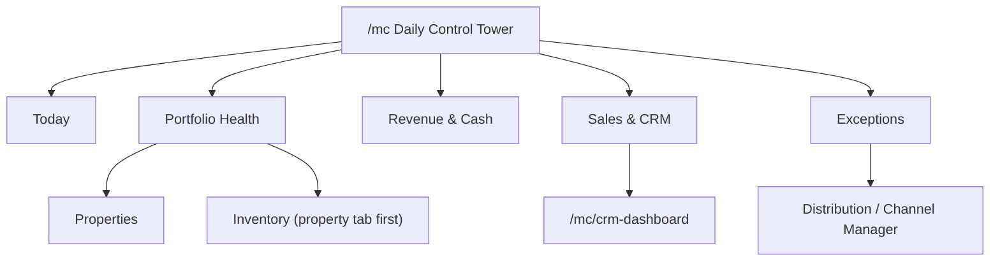

# MC Dashboard Core Audit

Date: 2026-03-11

Purpose: turn `/mc` from a mixed owner legacy dashboard into a real management-company control tower with clear boundaries for CRM, Distribution, Finance, Properties, and Operations.

This document implements the audit plan in five concrete outputs:

1. Widget-level audit matrix for `/mc`
2. New IA for `/mc` as a control tower
3. Production roadmap for Channel Manager
4. Inventory relocation plan into a property-centric IA
5. CRM home dedup plan between `/mc` and `/mc/crm-dashboard`

## 1. `/mc` Widget Audit Matrix

Scope note:
- Matrix covers widgets that are currently live through `BUSINESS_ROLES` in `src/lib/businessRoles.ts`.
- `today_briefing`, `today_actions`, and `invites` exist in code but are not part of the current role configs, so they are not treated as active `/mc` surface area.

Legend:
- `real`: directly reflects operational or financial data
- `hybrid`: real data plus heuristics, aggregation, or mixed platform content
- `static`: mostly curated, generated, or marketing-like

| Widget | Primary source | Classification | Scope quality | Urgency | Decision / next action |
|---|---|---|---|---|---|
| `morning_briefing` | `useDashboardMetrics()` + `useDayBriefing()` | `hybrid` | mixed company + owner + personal + platform content | High | Keep only the operational part. Split into `Today` and `Exceptions`; remove platform/news/recommendation payload from MC control tower. |
| `your_day` | `useDayBriefing()` | `hybrid` | mixed; includes CRM, bookings, reminders, documents, news, events | High | Keep as a role-aware feed only if filtered to actionable work items. Otherwise demote to personal assistant surface outside MC home. |
| `kpi` | `useDashboardMetrics()` | `hybrid` | partly company-ready, partly owner-scoped (`staff_members`, service requests, inventory, pending invoices) | Critical | Keep, but rebuild on one active-company property set and one booking model. This is core control-tower material once scoping is normalized. |
| `property_priority` | `useMyProperties()` + CRM tasks + bookings query | `hybrid` | company-aware but ranking is heuristic | Medium | Keep in `/mc`, but make ranking explainable: guest impact, owner impact, financial risk, overdue ops. |
| `cleaning_dashboard` | `useOperationalTasks()` | `real` | company-ready through accessible property IDs | Medium | Keep under `Today` / `Operations`. Rename to a broader housekeeping or field ops language if it becomes multi-role. |
| `property_status` | `useMyProperties()` + `usePropertyKeysOverview()` + `useUtilityOverview()` | `real` | company-ready | High | Keep under `Portfolio Health`. Convert into a risk-focused block: keys missing, utilities overdue, compliance/doc alerts. |
| `channel_sync` | `useChannelHealth()` + `ical-sync` edge function | `hybrid` | partially company-ready, but focused on external calendars and missing full OTA health model | Critical | Keep only as `Distribution Health`. Must merge iCal and OTA connection state, last success/failure, stale feed alerts, and property-level conflicts. |
| `unified_inbox` | `useOwnerChats()` | `real` | owner-only; not true MC/company scope | Critical | Remove from `/mc` until it is rebuilt for company/shared conversations. Current implementation breaks the MC control-tower promise. |
| `active_stays` | `useAllPropertyBookings()` | `real` | company-ready through accessible property IDs | High | Keep under `Today`. This is one of the most valuable operational widgets on the page. |
| `upcoming_payments` | direct `property_financials` query | `real` | mixed; manually reconstructs company property scope instead of using shared active-company access layer | High | Keep under `Revenue & Cash`, but refactor to shared finance scoping and explicit owner/vendor payout categories. |
| `crm_tasks` | `useCrmTasks()` + `useStaffMembers()` | `real` | company-ready if CRM task hooks stay company-scoped | High | Keep as compact CRM exception layer only. Show overdue/today tasks, not a second CRM dashboard. |
| `properties` | `useMyProperties()` | `real` | company-ready | High | Keep under `Portfolio Health` or `Properties`. This is a core navigation and context surface, not a marketing widget. |
| `maintenance_health` | `useMaintenanceSchedules()` | `real` | likely company-ready, operationally strong | High | Keep under `Portfolio Health` / `Exceptions`. Expose overdue counts and next-due clusters by property. |
| `revenue_insights` | `pricing_recommendations` fetched by `owner_id` | `hybrid` | owner-only and confidence-model-driven | Critical | Remove from MC home until recommendations become company-scoped, explainable, and measurable. Do not let an `AI` badge occupy core dashboard real estate without proof. |
| `operations` | `useTodayOperations()` / `useOperationalTasks()` | `real` | company-ready through accessible property IDs | High | Keep. This is one of the clearest control-tower blocks already in the product. |
| `active_deals` | `useAgentDeals(companyId)` | `real` | company-ready | High | Keep as a compact `Sales & CRM` lane with counts and urgent movement, then deep-link into dedicated CRM workspace. |
| `myuno_services` | `OwnerServiceRecommendations` + `getDailyServices()` | `static` | not MC-scoped; marketing/recommendation driven | Critical | Remove from `/mc`. This belongs to service discovery or owner upsell surfaces, not the management company home. |
| `menu` | `OwnerDashboardMenu` | `navigation` | redundant with sidebar | Critical | Remove from `/mc` desktop and mobile home. The sidebar/modules page already owns navigation. |

### Shell-Level Findings

These are not widgets but materially shape the dashboard:

| Shell element | Current role | Problem | Decision |
|---|---|---|---|
| `BusinessRoleSwitcher` | switches dashboard composition | useful, but can mask IA problems by changing widget sets instead of clarifying domains | Keep, but reduce role presets to visibility, not competing dashboard concepts |
| `DashboardPropertyFilter` | global property filter | strong and worth keeping | Keep as a top-level context selector |
| `SetupPromptBanner` | onboarding banner | useful for owner onboarding, weak for an MC operating shell | Show only in onboarding or empty-state scenarios, not as a permanent control-tower block |
| `QuickTaskDialog` | fast operational creation | strong operational affordance | Keep and expand to role-aware quick actions |

### Audit Summary for `/mc`

What is already strong:
- `active_stays`
- `operations`
- `property_status`
- `maintenance_health`
- `properties`
- compact `active_deals` and `crm_tasks`

What is useful but needs structural cleanup:
- `kpi`
- `morning_briefing`
- `your_day`
- `channel_sync`
- `upcoming_payments`

What should leave the MC home:
- `unified_inbox`
- `revenue_insights`
- `myuno_services`
- `menu`

## 2. Target IA for `/mc` as Management Company Control Tower

### Product principle

`/mc` should answer three questions in under 30 seconds:

1. What is going wrong today?
2. What is financially or operationally at risk?
3. What does the team need to do next?

It should not try to be:
- a second CRM home
- an owner upsell surface
- a service recommendation feed
- a general menu grid

### Recommended top-level IA

| Domain | Purpose | Primary outcomes |
|---|---|---|
| `Today` | immediate actions and time-sensitive workload | arrivals, departures, tasks due now, urgent CRM follow-ups |
| `Portfolio Health` | health of managed units and properties | maintenance risk, utility/doc/key issues, occupancy pressure, property alerts |
| `Revenue & Cash` | money at risk or due soon | pending payouts, invoices, expenses due, topline KPIs |
| `Sales & CRM` | compact business development visibility | hot deals, overdue CRM tasks, active pipeline snapshot |
| `Exceptions` | everything requiring intervention | sync failures, low stock, overdue maintenance, broken automation, missing documents |

### Proposed `/mc` composition

| Zone | Keep | Move / remove |
|---|---|---|
| `Today` | `morning_briefing` operational subset, `active_stays`, `operations`, `crm_tasks` | remove news/events/recommendations from `useDayBriefing()` |
| `Portfolio Health` | `property_status`, `maintenance_health`, `properties` | move inventory detail to property pages; do not let full inventory live as peer to CRM |
| `Revenue & Cash` | normalized `kpi`, `upcoming_payments` | remove owner-only pricing recommendations |
| `Sales & CRM` | compact `active_deals` + `crm_tasks` exceptions | remove any second full CRM home behavior from `/mc` |
| `Exceptions` | sync failures, overdue utilities, low stock, stale connections, unresolved conflicts | build this explicitly instead of scattering alerts inside multiple widgets |

### Recommended route roles

| Route | Proposed role |
|---|---|
| `/mc` | management company daily control tower |
| `/mc/crm-dashboard` | dedicated CRM workspace for sales execution |
| `/mc/channels` | Distribution workspace |
| `/mc/inventory` | temporary cross-property inventory index, eventually secondary to property tabs |
| `/mc/properties/:id/manage` | property operating workspace with tabs |

### IA recommendation

### P0 IA actions

1. Strip `/mc` down to control-tower blocks only.
2. Remove navigation duplication (`menu`) from the home surface.
3. Move owner/marketing widgets out of the MC shell.
4. Introduce a first-class `Exceptions` lane with severity ordering.
5. Standardize every widget header to answer: what happened, how urgent, where to act.

## 3. Channel Manager Roadmap as Production Distribution Module

### Current diagnosis

The current `ChannelManager` page already has meaningful pieces:
- connection and sync actions from `useExternalCalendars()`
- OTA connections from `useOtaConnections()`
- booking-derived source stats from `usePropertyBookings()`
- health UI from `useChannelHealth()`
- conflict UI and sync history widgets

But it is still not production-clean for a management company because:
- booking and sync truth is split across `orders/order_items`, `property_bookings`, `property_external_calendars`, and OTA connection state
- the dashboard widget sees only part of the picture
- logging is not yet elevated to an operational reliability model
- the UX mixes import/export, health, mode selection, and history without a single distribution mental model

### Position in product IA

Do not keep Channel Manager as a CRM-adjacent concept.

Recommended placement:
- label: `Distribution`
- route: keep `/mc/channels` short term, but position it in UI as `Channels & Distribution`
- dashboard role: only `Distribution Health` and exceptions should appear on `/mc`

### Target module structure

| Area | What it should show |
|---|---|
| `Connections` | per property: Airbnb, Booking, Vrbo, Google, iCal feeds, auth state, source-of-truth mode |
| `Sync Health` | last success, last failure, stale feed age, auto-sync state, channel status, retry |
| `Conflicts` | booking conflicts, availability collisions, manual overrides, blocked export cases |
| `Distribution Settings` | source of truth, pricing push mode, availability push mode, safe disable, audit trail |
| `History & Audit` | who changed what, when feed failed, when retries happened, why data drift occurred |

### P0 roadmap

| Priority | Workstream | Why it matters |
|---|---|---|
| P0 | unify booking source-of-truth model across distribution screens | current dashboard trust is limited while `orders` and legacy booking flows both exist |
| P0 | create one health model for iCal + OTA + property-level sync | without this, `/mc` cannot show reliable distribution health |
| P0 | normalize scoping to active company and accessible properties | management company staff need shared visibility, not owner-only assumptions |
| P0 | persist last success, last failure reason, stale threshold, retry state | required for real operational accountability |

### P1 roadmap

| Priority | Workstream | Why it matters |
|---|---|---|
| P1 | redesign page IA into Connections / Health / Conflicts / Settings | current tabs are feature-shaped, not ops-shaped |
| P1 | add property-level channel matrix | staff need to see which unit is broken, not only which connector exists |
| P1 | support safe disable and manual override with audit trail | mandatory for real distribution operations |
| P1 | expose conflict queue with assignment / resolution flow | sync conflicts should become work items, not just visual warnings |

### P2 roadmap

| Priority | Workstream | Why it matters |
|---|---|---|
| P2 | pricing push governance and distribution policy presets | supports managed portfolio scale |
| P2 | SLA-style health reporting and escalation rules | required once distribution becomes multi-user and business-critical |
| P2 | analytics for channel contribution vs sync risk | useful only after health and data model are stable |

### Production-ready acceptance criteria

Channel Manager should not be called production-ready until all are true:

- one clear booking truth per property
- one clear source-of-truth mode per property
- visible last success and last failure reason per channel
- stale-feed alerting on the page and on `/mc`
- retry failed sync from UI
- safe disable and manual override with audit trail
- company-wide scoping works for non-owner staff

## 4. Inventory Relocation to Property-Centric IA

### Current diagnosis

Inventory is conceptually tied to a unit, not to CRM and not to the top-level MC shell.

Code already shows that split:
- `InventoryPage.tsx` behaves like a top-level cross-property page
- `usePropertyInventory(propertyId)` is already the better domain shape: inventory per property
- low-stock numbers also leak into dashboard KPIs as an exception signal

This is a strong sign that inventory should become:
- primary in property detail
- secondary as a cross-property exception/reporting view

### Recommended IA

Primary home:
- `Properties > Property detail > Inventory`

Secondary home:
- `Properties > Inventory index` or `Operations > Inventory exceptions`

Dashboard role:
- only show low-stock / damaged / inspection exceptions on `/mc`

### Recommended property tab model

| Property tab | Why it belongs together |
|---|---|
| `Overview` | overall property status |
| `Calendar` | occupancy and arrivals/departures |
| `Operations` | tasks, housekeeping, maintenance |
| `Inventory` | stock, inspections, item history, damages |
| `Finance` | expenses, payouts, invoices |
| `Distribution` | channels, sync mode, conflicts |
| `Documents` | contracts, utilities, compliance |

### Relocation plan

| Phase | Change |
|---|---|
| P0 | standardize inventory queries on accessible properties / active company instead of owner assumptions |
| P0 | keep `/mc/inventory` as an index, but reposition it in navigation under `Properties` or `Operations`, not beside CRM concepts |
| P1 | add `Inventory` tab to property management page and route all add/edit flows through selected property context |
| P1 | connect `InspectionChecklist` to the property detail inventory workflow |
| P2 | turn `/mc/inventory` into exceptions and reporting only, or redirect to property-scoped entry points |

### Why this is better for myUNO

It fits the flywheel:
- each managed property becomes the operational unit of truth
- staff can work property-first
- owners get clearer reporting per unit
- low stock and damages become operational exceptions, not a floating standalone tool

## 5. CRM Home Dedup Between `/mc` and `/mc/crm-dashboard`

### Problem

Right now CRM is effectively duplicated:
- `/mc` already surfaces deals, tasks, KPIs, and actionability
- `/mc/crm-dashboard` is also a home-like summary page with filters, KPIs, tools, and pipeline entry

This creates two problems:
- the main MC dashboard competes with the CRM dashboard instead of linking into it
- users are forced to infer which screen is the real starting point for CRM work

### Recommended pattern

Use a strict split:

- `/mc` = company-wide control tower
- `/mc/crm-dashboard` = dedicated CRM execution workspace

That means:
- `/mc` shows only compact CRM signals
- `/mc/crm-dashboard` owns pipeline operations, deal creation/editing, filters, analytics, and CRM tools

### What stays on `/mc`

Only the compact layer:
- active deals count
- overdue or due-today CRM tasks
- hottest leads / top-of-funnel exceptions if truly actionable
- one CTA into CRM workspace

### What belongs only to `/mc/crm-dashboard`

- full pipeline board
- CRM KPI strip
- deal filters and search
- agent filters and pipeline selection
- CRM tools launcher
- create-deal primary workflow

### Recommended implementation rule

If a CRM block requires:
- multiple filters
- more than one CTA
- pipeline stage interaction
- analytics or secondary tools

then it does not belong on `/mc`; it belongs on `/mc/crm-dashboard`.

### Dedup roadmap

| Phase | Change |
|---|---|
| P0 | reduce `/mc` CRM content to one compact widget group |
| P0 | keep `/mc/crm-dashboard` as the only CRM workbench |
| P1 | rename/position `/mc/crm-dashboard` in nav as the clear CRM home |
| P1 | ensure contacts, sales pipeline, tasks, and analytics all branch from the dedicated CRM workspace |
| P2 | optionally alias route to `/mc/crm` while keeping backward compatibility |

### Decision

Keep:
- `/mc` as control tower
- `/mc/crm-dashboard` as CRM home/workbench

Remove:
- any second full CRM-home behavior from `/mc`

## Recommended Execution Order

1. Recompose `/mc` to the five-zone control tower model.
2. Remove owner-only and marketing widgets from the MC home.
3. Normalize KPI, upcoming payments, and channel health to active-company scoping.
4. Reposition Channel Manager under Distribution with a health-first UX.
5. Move Inventory toward property tabs and keep only exceptions on the dashboard.
6. Deduplicate CRM so `/mc/crm-dashboard` becomes the only deep CRM home.

## Key Source Files Reviewed

- `src/pages/owner/OwnerDashboard.tsx`
- `src/lib/businessRoles.ts`
- `src/hooks/useBusinessRole.ts`
- `src/hooks/useDashboardMetrics.ts`
- `src/hooks/useDayBriefing.ts`
- `src/hooks/useOperationalTasks.ts`
- `src/hooks/usePropertyBookings.ts`
- `src/hooks/useRevenueAnalytics.ts`
- `src/hooks/usePropertyChat.ts`
- `src/pages/owner/CrmDashboardPage.tsx`
- `src/pages/owner/ChannelManager.tsx`
- `src/pages/owner/InventoryPage.tsx`
- `src/hooks/useChannelHealth.ts`
- `src/hooks/useExternalCalendars.ts`
- `src/hooks/usePropertyInventory.ts`
- `src/hooks/useMyProperties.ts`

