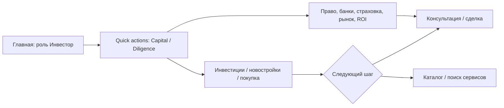
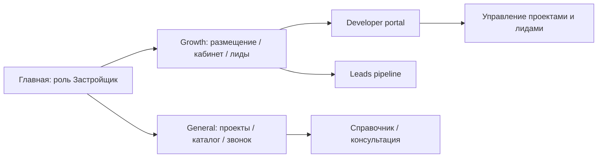

# Карты маршрутов: инвестор и застройщик

Кратко описывает ожидаемые сценарии, опорные экраны в продукте и соответствие каталога быстрых действий потребностям аудитории. Используется для UX-ревью и приоритизации бэклога.

## Инвестор (`investor`)

**Основные потребности:** капитал (куда вложить), новостройки / off-plan, покупка объекта, право и налоги, банки, страхование, рыночная аналитика и оценка ROI.

**Быстрые действия на главной** (группы: Capital, Diligence & deal support) соответствуют этим этапам: от размещения капитала до сопровождения сделки.

**Замечания по покрытию:** набор в `INVESTOR_ACTIONS` согласован с воронкой «капитал → сделка». Пробелы на уровне продукта (не только главной): глубокая due diligence (документы, сравнение проектов), портфель и отчёты — если есть в MC или Invest, стоит явно связать с главной (deeplink / блок «продолжить»).

---

## Застройщик (`real_estate_developer`)

**Основные потребности:** размещение и продвижение проекта, личный кабинет / проекты, лиды, видимость в каталоге застройщиков, связь с платформой (звонок / консультация).

**Быстрые действия** используют ту же группированную сетку, что и инвестор/бизнес: блок **«Рост и партнёрства»** (growth) — размещение проекта, кабинет, лиды; блок **«Быстрые действия»** (general) — проекты, каталог застройщиков, запись на звонок.

**Замечания по покрытию:** лиды и кабинет закрывают операционный цикл; для полного B2B-цикла часто не хватает явных шагов «аналитика продаж / отчёты», «медиа-кит / материалы» — при появлении маршрутов их стоит добавить в `REAL_ESTATE_DEVELOPER_ACTIONS` с отдельными `groupId`, чтобы не смешивать с потребительскими сценариями.

---

## Технические правки (роль не «перескакивает»)

- Персоны из БД и гостевой сессии **сортируются** в порядке `PERSONA_OPTIONS`, чтобы `personas[0]` совпадал с выбранной в герое ролью.
- При сохранении роли показывается **toast** при ошибке; в переключателе — **оптимистичное выделение** до завершения мутации.
- Для застройщика включена **группировка** быстрых действий (как у инвестора), чтобы не было скачка вёрстки между ролями.

Файлы: `src/hooks/useUserPersonas.ts`, `src/components/home/HeroBlock.tsx`, `src/lib/home/quickActionsCatalog.ts`.
