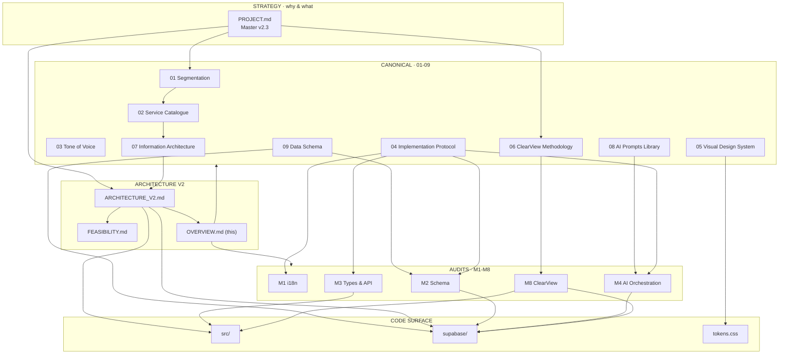

# Architecture Overview · myUNO

> **Назначение.** Единая точка входа в архитектуру платформы. Любой инженер находит нужный канонический документ, аудит или участок кода за 1–2 клика. Этот файл не описывает архитектуру — он навигирует к документам, которые её описывают.
>
> **Версия:** 1.0 · **Дата:** 2026-04-22 · **Owner:** Pavel + CTO

---

## 0 · TL;DR навигация

| Если тебе нужно… | Иди сюда |
|---|---|
| Понять, **что мы строим** и почему | [`/PROJECT.md`](../../../PROJECT.md) |
| Понять **целевую архитектуру** (роли · кластеры · surfaces) | [`ARCHITECTURE_V2.md`](./ARCHITECTURE_V2.md) |
| Узнать, **что уже сделано** vs **что осталось** | [`FEASIBILITY.md`](./FEASIBILITY.md) |
| Найти **схему БД** (таблицы, RLS, FK) | [`../09-data-schema.md`](../09-data-schema.md) |
| Изменить **AI-агента** (промпты) | [`../08-ai-prompts-library.md`](../08-ai-prompts-library.md) |
| Добавить/изменить **URL или субдомен** | [`../07-information-architecture.md`](../07-information-architecture.md) |
| Стилизовать **новый компонент** (цвет, шрифт, spacing) | [`../05-visual-design-system.md`](../05-visual-design-system.md) + [`/DESIGN.md`](../../../DESIGN.md) |
| Добавить **сервис в каталог** | [`../02-service-catalogue-v2.md`](../02-service-catalogue-v2.md) |
| Понять **персону пользователя** | [`../01-segmentation-framework.md`](../01-segmentation-framework.md) |
| Запустить **миграционный спринт** (M-веха) | [`../04-implementation-protocol.md`](../04-implementation-protocol.md) |
| Встроить **ClearView** | [`../06-clearview-methodology.md`](../06-clearview-methodology.md) + [`../audits/M8-clearview-integration-protocol.md`](../audits/M8-clearview-integration-protocol.md) |
| Получить **инструкции для AI-ассистента** | [`/CLAUDE.md`](../../../CLAUDE.md) · [`/.cursorrules`](../../../.cursorrules) |

---

## 1 · Карта зависимостей



**Как читать.** Стрелка `A → B` значит «B опирается на A» либо «A определяет правила для B». PROJECT.md — корень. Канонические документы определяют правила. Architecture V2 — целевая модель. Audits — операционные срезы вех. Code — реализация.

---

## 2 · Слои архитектуры

| Слой | Назначение | Источник истины |
|---|---|---|
| **L0 · Strategy** | Бизнес-модель, моаты, KPI, аудитория | [`PROJECT.md`](../../../PROJECT.md) |
| **L1 · Domain** | Персоны, услуги, голос, ClearView | [`01`](../01-segmentation-framework.md) · [`02`](../02-service-catalogue-v2.md) · [`03`](../03-tone-of-voice.md) · [`06`](../06-clearview-methodology.md) |
| **L2 · Architecture** | Roles · clusters · surfaces · hard rules | [`ARCHITECTURE_V2.md`](./ARCHITECTURE_V2.md) · [`07`](../07-information-architecture.md) |
| **L3 · Data & AI** | Схема БД, промпты, контракты | [`09`](../09-data-schema.md) · [`08`](../08-ai-prompts-library.md) |
| **L4 · Design** | Цвет, типографика, компоненты, токены | [`05`](../05-visual-design-system.md) · [`/DESIGN.md`](../../../DESIGN.md) · `src/styles/tokens.css` |
| **L5 · Process** | Миграционный playbook · вехи · audits | [`04`](../04-implementation-protocol.md) · [`../audits/`](../audits/) |
| **L6 · Code** | Реализация | `src/` · `supabase/functions/` · `supabase/migrations/` |

**Правило.** Изменение в нижнем слое не должно противоречить верхнему. При конфликте — правится **код**, не документ. Если документ устарел — отдельный PR в документ, потом PR в код.

---

## 3 · Hard rules (из ARCHITECTURE_V2.md §13)

Эти правила нарушать нельзя — нарушение блокирует merge.

1. **Never add a new top-level route.** Только под кластер или `/operate/*`.
2. **Never create a new shell.** `MiniAppLayout` или Operate shell.
3. **Never hardcode a hex colour.** Только переменные из `src/styles/tokens.css`.
4. **Never import across cluster boundaries.** Только через L4 primitives или L3 services.
5. **Never auto-execute money moves from an agent.** User-confirmed intent only.
6. **Audit marker on every money screen** (tx id + ledger entry id + timestamp).
7. **Feature flag (`feature_flag:*` в `system_settings`)** на каждой новой фиче до GA.

→ полный контекст: [`ARCHITECTURE_V2.md §13`](./ARCHITECTURE_V2.md)

---

## 4 · Ключевые модули кода

### 4.1 · Frontend (`src/`)

| Модуль | Назначение | Связанный документ |
|---|---|---|
| `src/pages/` | 366+ страниц, организованы по вертикалям | [`07`](../07-information-architecture.md) |
| `src/components/` | 1000+ компонентов в 60+ доменных папках | [`05`](../05-visual-design-system.md) |
| `src/hooks/` | 345 кастомных хуков, бизнес-логика | [`09`](../09-data-schema.md) |
| `src/contexts/` | 11 глобальных провайдеров (Auth, Cart, Language, Theme, …) | [`ARCHITECTURE_V2.md`](./ARCHITECTURE_V2.md) §Surfaces |
| `src/integrations/supabase/` | Auto-generated client + types — **DO NOT EDIT** | [`09`](../09-data-schema.md) |
| `src/lib/taxonomies/` | Single source of truth для классификаций | [`02`](../02-service-catalogue-v2.md) |
| `src/lib/verticals.ts` | Реестр всех вертикалей | [`07`](../07-information-architecture.md) |
| `src/styles/tokens.css` | **Источник истины** для цвета/шрифта/spacing в runtime | [`05`](../05-visual-design-system.md) · [`/DESIGN.md`](../../../DESIGN.md) |
| `src/i18n/` | Bilingual RU/EN | [`03`](../03-tone-of-voice.md) · [`audits/M1`](../audits/M1-i18n-audit.md) |

### 4.2 · Backend (`supabase/`)

| Модуль | Назначение | Связанный документ |
|---|---|---|
| `supabase/functions/_shared/` | Переиспользуемые утилиты (admin-config, checkout-handler, stripe) | [`/CLAUDE.md`](../../../CLAUDE.md) §5 |
| `supabase/functions/stripe-webhook/` | Источник истины для записи orders + ledger | [`/CLAUDE.md`](../../../CLAUDE.md) §4 (Financial flow) |
| `supabase/functions/canonical-persona-detect/` | AI-детекция lifecycle/role | [`audits/M4`](../audits/M4-ai-orchestration.md) |
| `supabase/functions/<vertical>-*` | Per-vertical edge functions | [`02`](../02-service-catalogue-v2.md) |
| `supabase/migrations/` | SQL-миграции — **DO NOT EDIT** | [`09`](../09-data-schema.md) · [`audits/M2`](../audits/M2-schema-extension.md) |

### 4.3 · Ключевые таблицы БД

| Таблица | Назначение | Связано |
|---|---|---|
| `profiles` | Пользователи + lifecycle/role/cluster + roles_stack | [`01`](../01-segmentation-framework.md) · [`audits/M2`](../audits/M2-schema-extension.md) |
| `orders` · `order_items` · `order_*` | Все транзакции (Stripe + cash + bank) | [`/CLAUDE.md`](../../../CLAUDE.md) §4 |
| `payment_intents` | Stripe payment tracking | [`/CLAUDE.md`](../../../CLAUDE.md) §4 |
| `ledger_entries` · `ledger_accounts` | Double-entry audit trail | [`/CLAUDE.md`](../../../CLAUDE.md) §4 |
| `vendor_payouts` | Vendor payout management | [`02`](../02-service-catalogue-v2.md) |
| `system_settings` | Feature flags · admin contacts · stripe mode | [`/CLAUDE.md`](../../../CLAUDE.md) §5 |
| `clearview_*` (6 таблиц) | ClearView рейтинги off-plan | [`06`](../06-clearview-methodology.md) · [`audits/M8`](../audits/M8-clearview-integration-protocol.md) |
| `lead_events` · `lead_scores` | Lead intelligence + scoring trigger | [`09`](../09-data-schema.md) §7 |

→ полный реестр: [`09-data-schema.md`](../09-data-schema.md)

---

## 5 · Surfaces × Clusters матрица

**Surfaces (6):** Home · Discover · Operate · Wallet · Me · Admin
**Clusters (6, colour-locked):** Arrive · Live · Manage · Invest · Legal · Build

| Surface | Маршрут | Основной потребитель | Источник правил |
|---|---|---|---|
| Home | `/` | LifeOS — все роли | [`07`](../07-information-architecture.md) |
| Discover | `/discover` | Гости, резиденты | [`02`](../02-service-catalogue-v2.md) |
| Operate | `/operate` · `/owner` · `/mc` | Собственники, УК, vendors | [`ARCHITECTURE_V2.md`](./ARCHITECTURE_V2.md) §Operate |
| Wallet | `/wallet` | Все роли | [`/CLAUDE.md`](../../../CLAUDE.md) §4 |
| Me | `/account` | Все роли | [`07`](../07-information-architecture.md) |
| Admin | `/admin` | Platform staff | [`ARCHITECTURE_V2.md`](./ARCHITECTURE_V2.md) §Admin |

→ детали навигации, SSO, субдоменов: [`07-information-architecture.md`](../07-information-architecture.md)

---

## 6 · Веховой статус (M1 → M8)

| Веха | Тема | Статус | Документ |
|---|---|---|---|
| M1 | i18n audit | ✅ done | [audits/M1](../audits/M1-i18n-audit.md) |
| M2 | Schema extension (lifecycle/role columns) | ✅ done | [audits/M2](../audits/M2-schema-extension.md) |
| M3 | TypeScript types + API contracts + хуки | ✅ done | [audits/M3](../audits/M3-types-and-api-contracts.md) |
| M4 | AI-orchestration (persona/lifecycle detection) | ✅ done | [audits/M4](../audits/M4-ai-orchestration.md) |
| M5 | UX-обвязка детекции (preview/apply UI) | 🔜 next | — |
| M6 | Cross-domain SSO + субдомены | ⏳ planned | [`07`](../07-information-architecture.md) |
| M7 | Production hardening | ⏳ planned | [`04`](../04-implementation-protocol.md) |
| M8 | ClearView integration (parallel track) | 📋 protocol | [audits/M8](../audits/M8-clearview-integration-protocol.md) |

→ полный playbook: [`04-implementation-protocol.md`](../04-implementation-protocol.md)

---

## 7 · Decision tree: «куда положить новый код?»

```
Новая фича приходит к тебе. Спроси по порядку:

1. Это новая вертикаль или микро-приложение?
   → docs/canonical/02 (каталог) + docs/canonical/07 (URL)
   → src/pages/<vertical>/, src/lib/verticals.ts, MiniAppLayout

2. Это изменение домена (BD, типы, API)?
   → docs/canonical/09 (схема), audits/M2-M3 (примеры)
   → supabase/migrations/, src/integrations/supabase/types.ts (auto)

3. Это изменение AI-поведения?
   → docs/canonical/08 (промпты)
   → supabase/functions/canonical-* + src/hooks/useDetect*

4. Это изменение визуала?
   → docs/canonical/05 + DESIGN.md
   → src/styles/tokens.css (НЕ хардкод hex), tailwind.config.ts

5. Это новая роль/cluster/surface?
   → STOP. Архитектурное решение.
   → ARCHITECTURE_V2.md + Pavel review + ADR

6. Это деньги (checkout, ledger, payout)?
   → CLAUDE.md §4 + Hard rule #5, #6
   → supabase/functions/stripe-webhook + record_ledger_entries
```

---

## 8 · Поддержание этого документа

**Когда обновлять:**
- При добавлении нового канонического документа → секция §0 + диаграмма §1.
- При завершении вехи (M5, M6, M7) → секция §6.
- При появлении новой таблицы в `09-data-schema.md` → секция §4.3 (только ключевые).
- При изменении hard rules в `ARCHITECTURE_V2.md §13` → секция §3.

**Когда НЕ обновлять:** при рутинных изменениях кода. Этот документ — навигатор, не журнал.

**Версионирование:** через [`../CHANGELOG.md`](../CHANGELOG.md). Этот файл — карта; контент живёт в первоисточниках.

---

*Architecture Overview · v1.0 · 2026-04-22 · Owner: Pavel + CTO*

*Принцип: один файл, одна карта, две минуты до нужного документа.*
